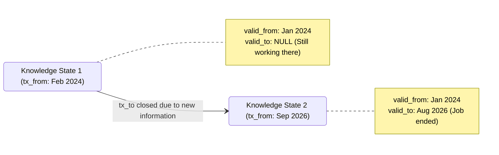
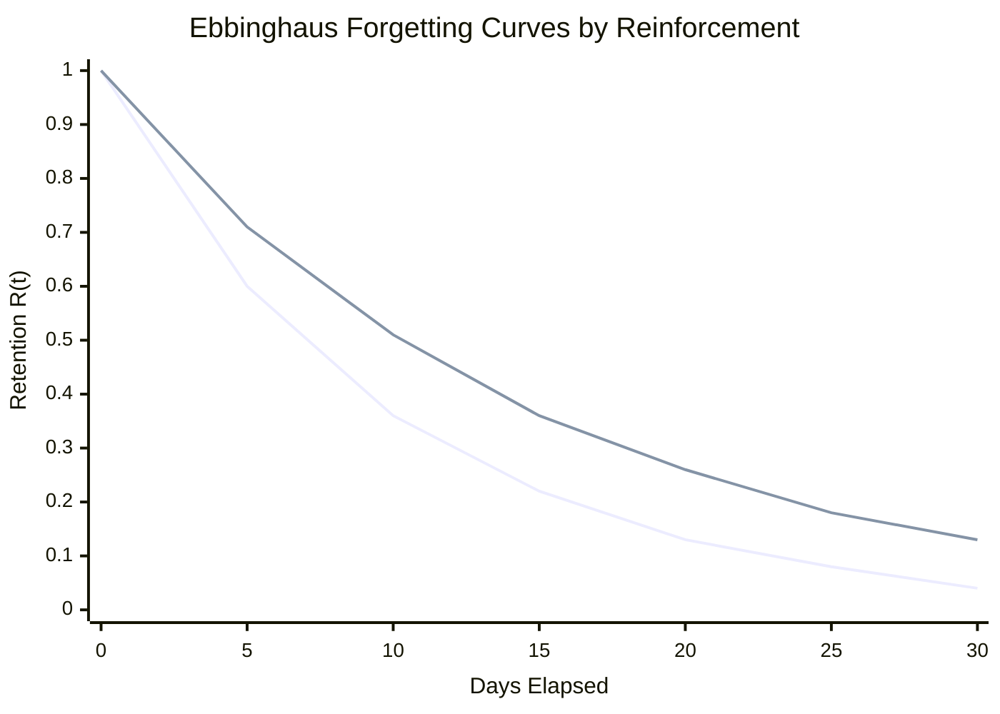

# Architecture of Recall

Recall is a specialized temporal memory engine. This document outlines the architectural boundaries and theoretical models that power it.

## 1. The Bitemporal Model

Traditional databases store facts as they exist *now*. Recall stores facts using a **Bitemporal Knowledge Graph**. Every fact has two distinct, orthogonal timelines.

### Half-Open Intervals
We model both timelines using half-open intervals: `[start_time, end_time)`.
- `NULL` represents infinity (the fact remains true indefinitely, or we still hold this belief).

### The Two Axes
1. **Valid Time (`valid_from`, `valid_to`)**: When was this fact true in the real world?
   *Example: "John worked at Google from Jan 2024 to Aug 2026."*
2. **Transaction Time (`tx_from`, `tx_to`)**: When did the system learn or hold this belief?
   *Example: "We learned about the Google job in Feb 2024. We learned he left in Sep 2026."*

## 2. Ebbinghaus Memory Decay

To retrieve facts contextually, Recall implements **Ebbinghaus Memory Decay** mixed with conversational reinforcement counting. 

Instead of treating all stored facts equally, we score retrievability $R(t)$ based on how recently and frequently a fact has been reinforced.

$$ R(t) = \exp\left(-\frac{t}{S}\right) $$
$$ S = S_{\text{base}} \times (1 + \alpha \cdot N) $$

- $t$: Elapsed days since the fact was learned or last reinforced.
- $N$: Number of independent reinforcements (e.g., times the user brought it up).
- $S_{\text{base}}$: Base memory stability.

*(Top curve: N=1 reinforcement; Bottom curve: N=0 reinforcements)*

## 3. Predicate Cardinality

Recall resolves conflicts deterministically using Predicate Policies:
*   **Single-Valued** (`primary_employer`, `residence`): New facts automatically cap the `valid_to` of the old facts.
*   **Multi-Valued** (`likes`, `speaks_language`): Coexist peacefully across identical valid intervals.
*   **Retraction**: Explicit user interventions (`USER_EDIT`) that force-close prior assertions.

## 4. Entity Resolution Pipeline

Entities are resolved before facts are applied. We use a 4-stage fallback:
1. Exact Canonical ID match.
2. Exact Canonical Name match.
3. Exact Alias match.
4. **Jaro-Winkler Fuzzy Match** (Threshold > 0.85). If ambiguity margin (< 0.05) is detected, it falls back to requiring explicit clarification.
